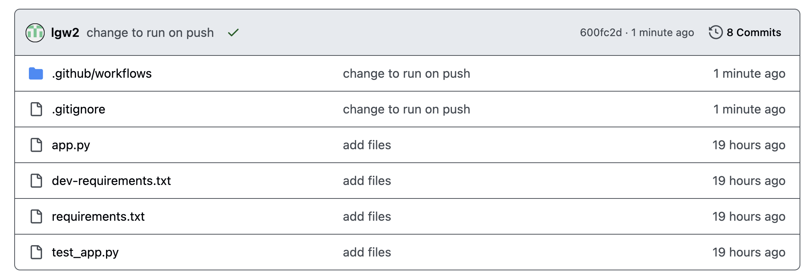

Note: this tutorial is based on the tutorial found [here](https://calmcode.io/course/github-actions/introduction).

On your computer, make a new directory and copy the four files from [here](https://github.com/the-brAIn-lab/tutorials/tree/main/github_actions/files) into it. These define a simple web application, some tests for it, and the requirements for the environment in which to run it.

 If you want to check that the tests are working locally before we try to use GitHub Actions to run the tests, you should either set up a conda environment or a python `venv` to install the dependencies. so do one of the below, and then proceed to run tests locally:

 ## Set up a local environment to run tests

Do exactly ONE of the following: 

### conda instructions

```
conda create --name github_actions_tutorial
conda activate github_actions_tutorial
conda install pip
pip install -r requirements.txt
pip install -r dev-requirements.txt
```

### Python venv instructions

```
python -m venv github_actions_tutorial
source github_actions_tutorial/bin/activate
pip install -r requirements.txt
pip install -r dev-requirements.txt
```

## Run tests locally

From the same directory (containing your `app.py` and `test_app.py` files), run

```
python -m pytest
```

Ask for help if the four tests don't pass. Warnings are okay!

## Make a new GitHub repo and push your files to that remote

If you remember how to do this from Vince's presentation, great! If not, here are instructions:

Initialize your current directory as a git repository by running:

```
git init
```

Now, on the browser, go to github.com, and under "Repositories," click the "New" button. Name your repository whatever you would like and keep the default settings. Click "Create Repository" and then follow the second set of instructions to push an existing repository from the command line.

Once you are done, if you check the GitHub repo on browser, should look like this


### set up github actions to run test automatically on push

Add the following file to your directory, specifically in the `.github/workflows/` directory. (You will need to create these--ask for help if you need it!) You can call the file `unit-tests.yml` if you would like.

```
name: Python Unit Tests

on:
  push:
    branches:
    - main

jobs:
  build:
    runs-on: ubuntu-latest

    steps:
    - uses: actions/checkout@v2
    - name: Set up Python
      uses: actions/setup-python@v4
      with:
        python-version: '3.13'
    - name: Install dependencies
      run: |
        python -m pip install --upgrade pip
        python -m pip install -r requirements.txt
        python -m pip install -r dev-requirements.txt
    - name: Test with pytest
      run: |
        pytest --verbose
```

Then add, commit, and push the file. Now, whenever you push to this repository (on the `main` branch), the unit tests will run on a virtual ubuntu computer set up by GitHub. You can see the result of the tests on the browser by looking at the commit:



Click on the green check mark to see details of the run (or red x if your tests failed!).

## Some more optional tasks if you have time

### Make a change that breaks at least one unit test.

Push and confirm!

### Change to run on pull request to main, not push.

The "proper" way to contribute to a git repository is through the branch, merge, pull request framework, and so you will more commonly see tests running on pull requests into `main` than pushes into `main`.

To make this change, change the "on" parameter in your 
`unit-tests.yml` to run on `pull-request` instead of `push`. That is, change the file to look like

```
name: Python Unit Tests

on:
  pull_request:
    branches:
    - main

jobs:
  build:
    runs-on: ubuntu-latest

    steps:
    - uses: actions/checkout@v2
    - name: Set up Python
      uses: actions/setup-python@v4
      with:
        python-version: '3.13'
    - name: Install dependencies
      run: |
        python -m pip install --upgrade pip
        python -m pip install -r requirements.txt
        python -m pip install -r dev-requirements.txt
    - name: Test with pytest
      run: |
        pytest --verbose
```

Now,
create and switch to a branch called `add-gha`:
```
git checkout -b add-gha
```
then add and commit your file as normal (`git add .github/workflows/unit-test.yml`) 

Then push this branch:

```
git push origin add-gha
```

Then go to the repository GitHub via the browser and create pull request and merge. The tests should run!


